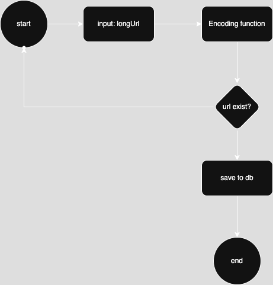
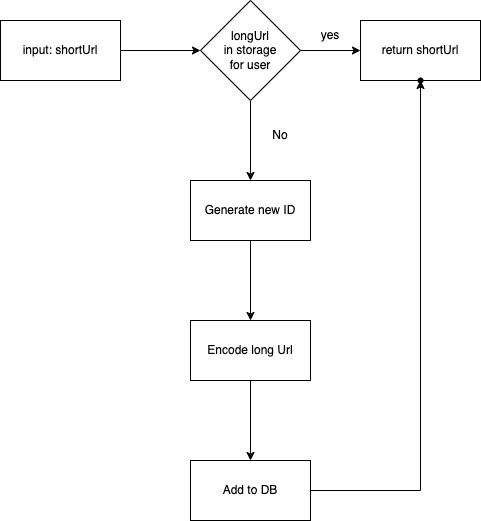
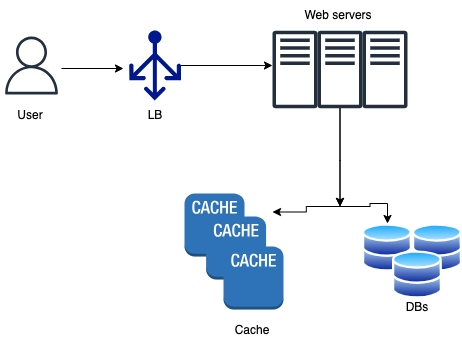

# URl Shortener
## Functional requirements

- 100M generated per day
- URL is short as possible
- characters allowed [a-zA-Z0-9]
- no deletion or update is allowed (if allowed some kind of reclamation of short url will need to be implemented)

## Back of envelop estimation

- Urls per second generated: 100M / 3600 / 24 = 1160
- Read operation R: 1160 * R per second. if R is 10 => 11600 reads per second. This estimation based on assumption that we have 1:R ratio of writes to reads. 10 arbitrary number is was chosen at random
- Amount of records: if service runs for 10 years 10*365*100m = 365B
- Assume avg url is 100 char long
- storage requirements is 365B * 100 bytes = 36.5TB (urls only no meta data)

## High level design

### API endpoint

We require 2 endpoints:
    - Get long url for short url
        GET api/v1/shorturl
        - Return long url
    - Get short url
        POST api/v1/shorten
        - Required Parameter:
        {long_url:string}
        - Returns short url

## Deep dive

Data model:

| urlTable        |
|-----------------|
| PK id(auto inc) |
|-----------------|
| shortUrl        |
|-----------------|
| LongUrl         |
|-----------------|
| userId          |
|-----------------|

It can also include analytics like views

## URL encoding function(hash function)

Encoded value consist of [0-9a-zA-Z] => 62 possible characters. Which gives > 62^n diff values, where n is length of the short URl. 'more than' because 62 doesn't include empty characters so /0 or /1 is not included in the 62^n. To avoid predictability some of this can be twicked: url needs to be at least 3 char.
Another concideration can be made to exclude characters which looks the same as LliI0O => 58 characters allowed, this increases usability but decrease amount of the urls we can generate
For the current requirement we need to find the smallest n which sutisfies 365B reconds. anything equal or more than 5 should sutisfy the requirement. 62^5 ~ 916B.

### Posibilities for encoding function

1. Use hash algorithm. Draw back: need to implement collision resolution. The easiest way is to add predefined string, like timestamp to url and hash it to get different hash.
2. Use record id as short url hash. Draw back: very predictable can lead to security issue.
3. hash recod id to make less predicatable. The easiest way is to alphabet size base encoding. 62 in this case

### URL shortening implementation

We'll take 62 base encoding. It depends on id of the record which is unique so it has no collision and its easy to scale horizontally, without requiring strong consistency

1. User provides new url to shorten.
2. Check if url already was shorten for this user.
3. Generate new ID

### URL redirect deep dive

1. User enters/clicks short url.
2. LB forwards the request to web servers.
3. if short url exists in cache, return correcponding long URL.
4. if short url is not in cache, get long URL from the database if exists and cache it. Otherwise return not found.

## Extra points

1. Rate limiter can be added to LB to metigate possible DDOS attacks.
2. Scaling web servers. As they are stateless we can just add more web servers.
3. Scaling DB. Adding more replicas or sharding is common.
    3.1 If we want to scale horizontally we can split all the possible IDs to ranges and use consistent hashing to distribute them among the DBs. Ex. 1-10000000 goes to DB1, 10000001-20000000 goes to server 2. This solution requires orchestration.
4. For cache we can use MongoDb as it made for read-heavy operations. Amount cache severs is depend on latensy of response L and amount of operations required
5. if we want to track the analytics we can save it in the cache and periodically sync it to DB.